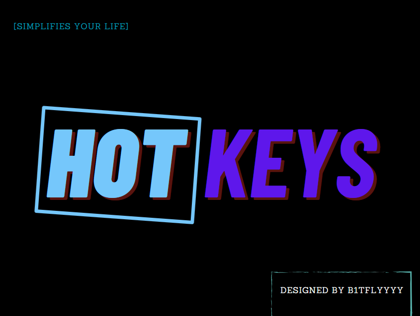

<div style="text-align: center">
  
</div>

## What can this project do ?
This project can simplify your life, now instead of tediously searching for the application on your desktop, you can press a couple of keys and it will launch from anywhere. Here, you can also attach the application to one button or two, as you prefer.

---
## About config file:
The first thing you need to do is create a config file, which has the .txt extension. Then, in the config file, using a specific language, you must write the button definition that includes the following parameters: whether two buttons are used, the value of the first button, the value of the second button (if it is used), and the path to the application that will be launched. It is also important to mention that there is an option to close the application by pressing your button combination + the DEL(delete) button.

---
## Here are several examples for the config file:
```
The first sample for one button: `double_buttons: 0; button_1 = 0x11; path->C:\\path\\to\\your\\app;` 
The second sample for two buttons: `double_buttons: 1; button_1 = 0x11; button_2 = 0x31; path->C:\\path\\to\\your\\app;`
```
You can see the virtual key codes [here](https://learn.microsoft.com/en-us/windows/win32/inputdev/virtual-key-codes).


